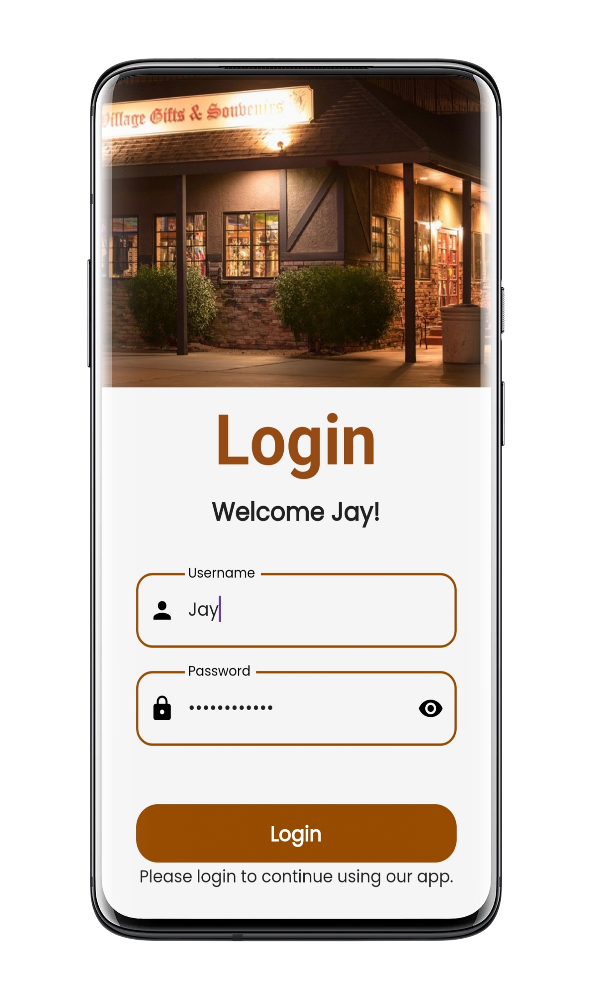

<h1 align="center">Rural4Us- Ecommerce App

</h1>

## 📱The App:
An E-commerce application built using Flutter Framework. Aimed at providing an immersive and unique experience that makes online shopping of famous rural items a much simpler and seamless process. I have also used VelcityX management state which is a minimalist Flutter framework inspired from TailwindCSS and SwiftUI for rapidly building flutter apps .

The App will contain a few components: OnBoarding Screen(Splash Screen),Login Screen, Home Screen(Product Listing Screen), Product Details Screen with dummy text description, Add to Cart Screen (Ordering Process).

 ## 💭Features:
🎯Easy login & registration

🎯User-friendly product searching and sorting

🎯Product gallery

🎯Shopping cart

## 📲OnBoarding Screen:
Onboarding Screen gives a short overview of an app. This Screen consists of three layouts which slide as we swipe left.

|  |   |  |
| :--------------------------------:       | :---------------------------------------: | :----------------------------------:     |
|                Layout 1                  |                 Layout 2                  |                  Layout 3                |  

## 🔐LogIn Screen:
The login screen I have build here is simple in its visual aspects. First there is a container widget for the image. Then about the screen itself, Login and Welcome!.  Now, we have two text form fields, user name and password, to get login/sign-in credentials from user. After that, there is an Animated container widget for the Login button which on tap shows animation before being navigated to the home screen.

|  |   | 
| :--------------------------------:       | :---------------------------------------: | 
|             Without credentials          |             With Credentials              |    

## 🔎Home Screen:
