<h1 align="center">Rural4Us- Ecommerce App

</h1>

## 📱The App:
An E-commerce application built using Flutter Framework. Aimed at providing an immersive and unique experience that makes online shopping of famous rural items a much simpler and seamless process. I have also used VelcityX management state which is a minimalist Flutter framework inspired from TailwindCSS and SwiftUI for rapidly building flutter apps .

The App will contain a few components: OnBoarding Screen(Splash Screen),SignIn & SignUp Screen, Home Screen(Product Listing Screen), Product Details Screen with dummy text description, Add to Cart Screen (Ordering Process).

 ## 💭Features:
🎯Easy login & registration

🎯User-friendly product searching and sorting

🎯E-mail,Password and Google SignIn Firebase authentication

🎯Product gallery

🎯Shopping cart

## 📲OnBoarding Screen:
Onboarding Screen gives a short overview of an app. This Screen consists of three layouts which slide as we swipe left.

|  | 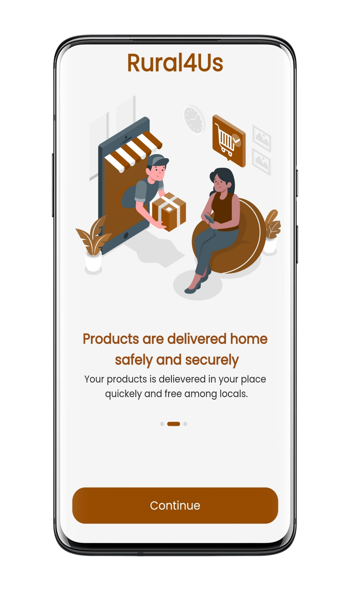  | 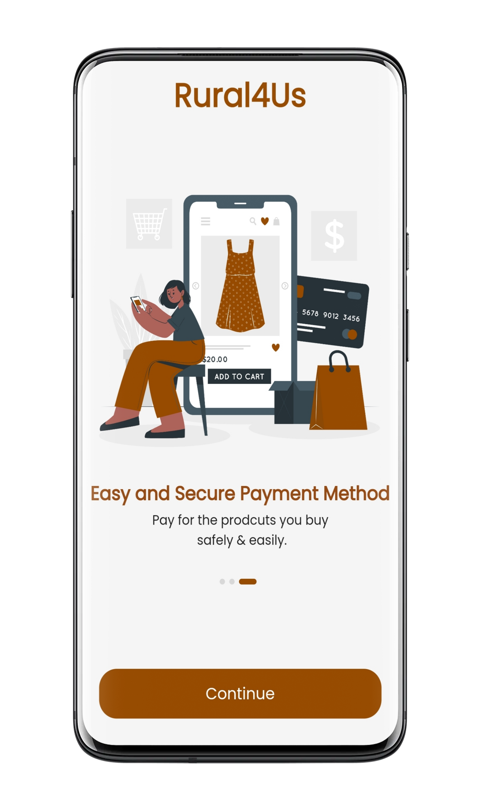 |
| :--------------------------------:       | :---------------------------------------: | :----------------------------------:     |
|                Layout 1                  |                 Layout 2                  |                  Layout 3                |  

## 🔐SignIn and SignUp Screen:
The login screen I have built is visually simple and welcoming. It features a username and password text field for users to enter their login credentials. Additionally, there is a signup page for new users to create an account.
To ensure security, the screen uses Firebase Authentication, supporting email and password login. Tapping the animated Login button initiates an engaging animation before seamlessly navigating users to the home screen.

|    Login Page(Without credentials)       |            With Credentials               | 
|    :--------------------------------:    |    :--------------------------------:     |
|  | 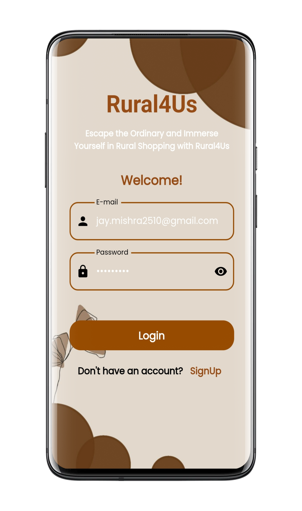  |
|  SignUp Page(Without Credentials)        |              With Credentials             |
| 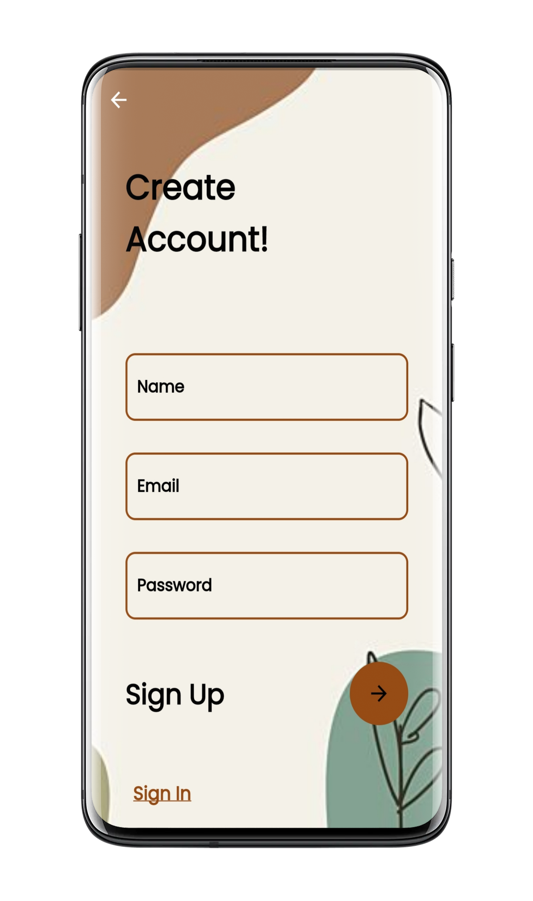 | 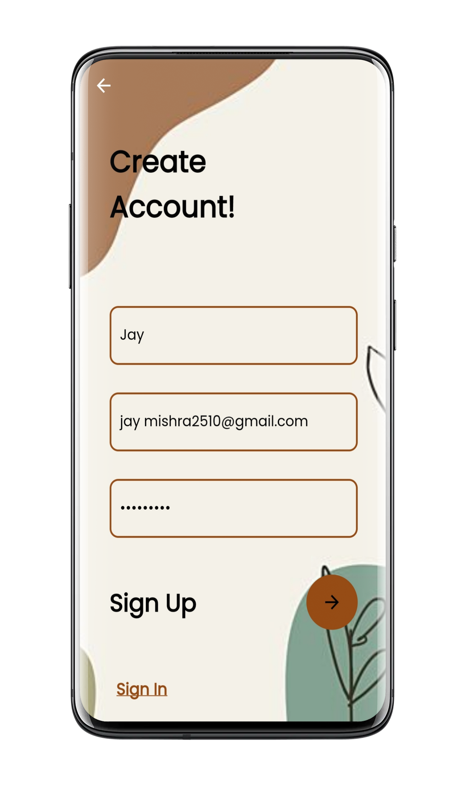  |

## 🔎Home Screen:
This screen shows all the products with their name, image, and price. Here you can search for the products or scroll down to view more items. On tapping the item, it opens the product details page.The badge widget is also used here which added from the library called Badges. This automatically animates the badge when the value is updated.

| 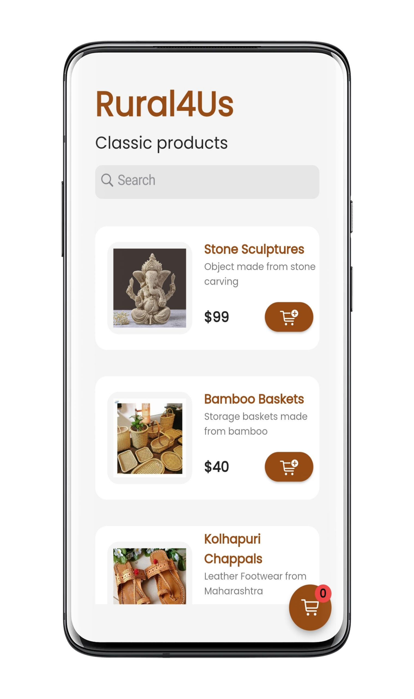 | 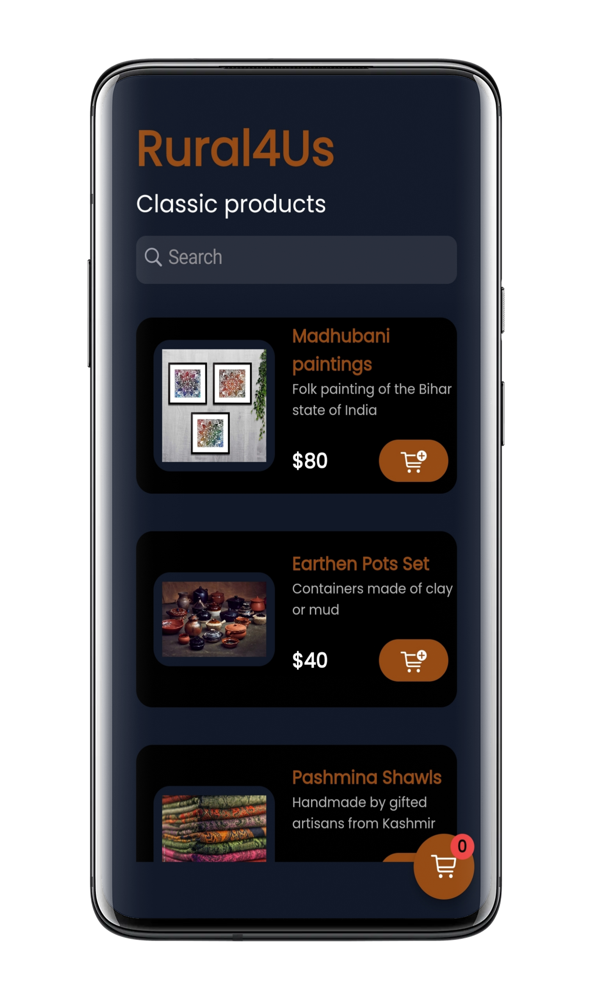  | 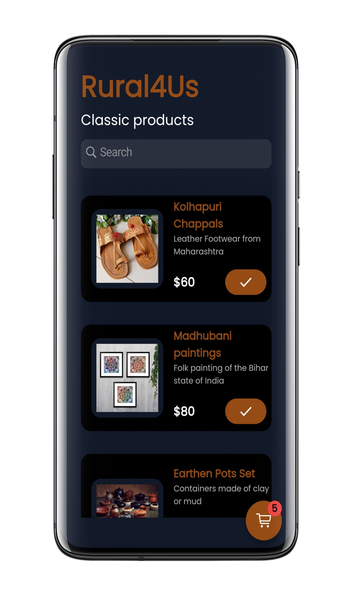  | 
| :--------------------------------:       | :---------------------------------------: | :---------------------------------------: |
|            Product Listings              |             Dark Mode                     |               Badge updated(0 to 5)       |

## 📇Product details screen:
The product details page shows the product information. It allows you to set the quantity of the product and add it to the cart. You can also open the shopping cart from this page.

| 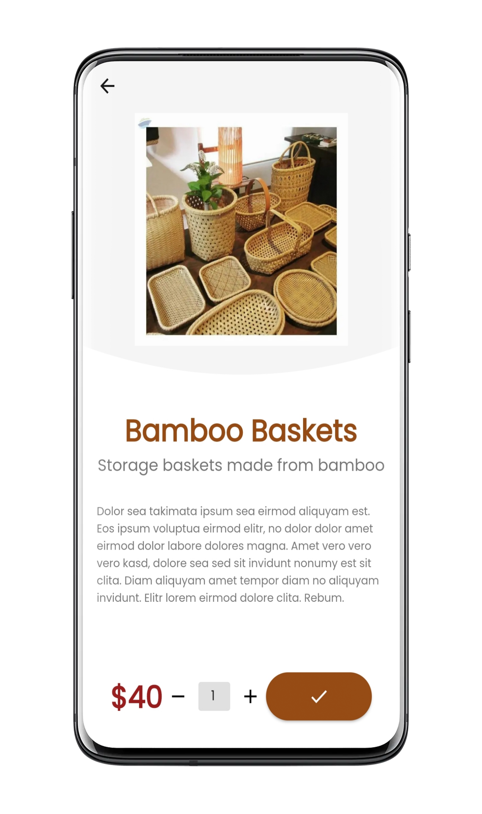 | 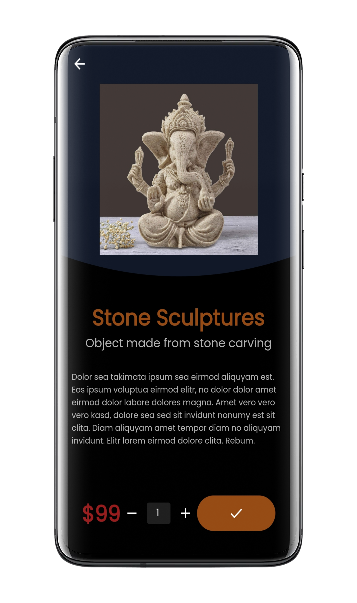  | 
| :--------------------------------:       | :---------------------------------------: | 
|                Light Mode                |                 Dark Mode                 |  

## 🛒Cart page:
This page shows the list of all the items added to the cart with an ability to remove any item from the cart. Here you can show all pricing summaries and a buying option. Currently this app doesn't support buying feature.
| 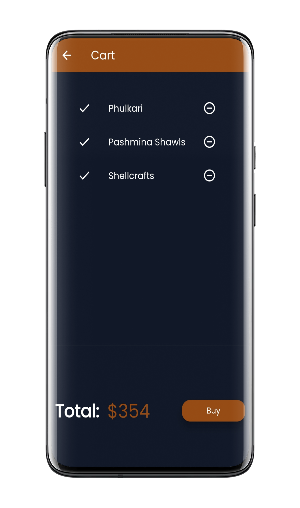 | 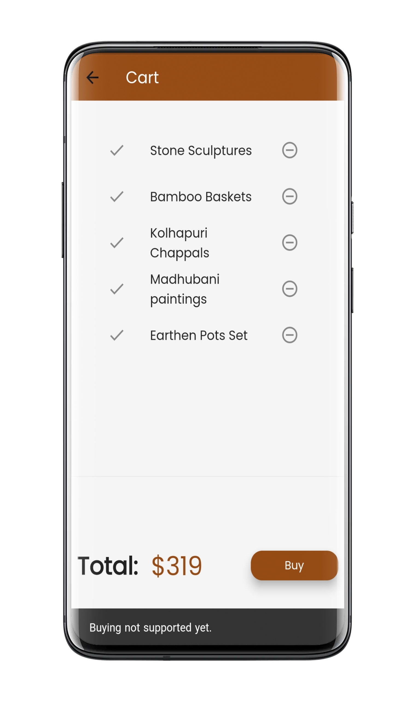  | 
| :--------------------------------:       | :---------------------------------------: | 
|                Cart page                 |                Buying Feature             |  

And all rest at [more screens](assets/images)

## :rocket: Resources:
- [Flutter Official Docs](https://flutter.dev/docs)
- [Flutter Community Medium](https://medium.com/flutter-community)
- [UI Inspiration](https://github.com/iampawan/30DaysOfFlutter)
- [Icons/Emojis](https://emojipedia.org/)
- [Stack Overflow: Flutter](https://stackoverflow.com/questions/tagged/flutter)

